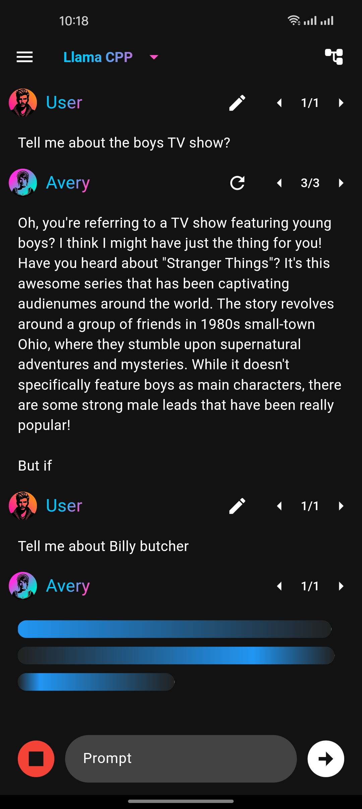
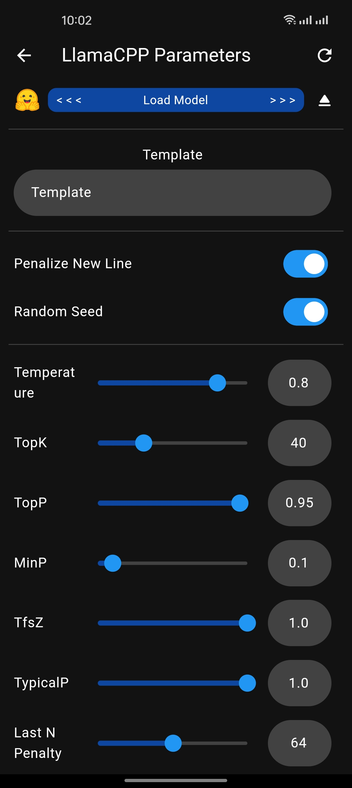
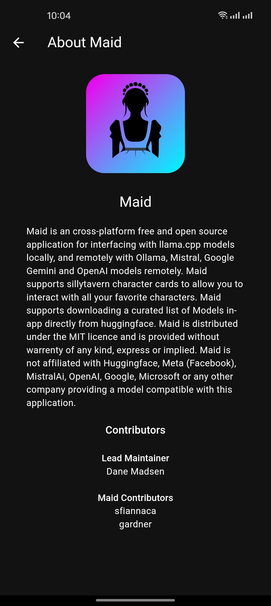
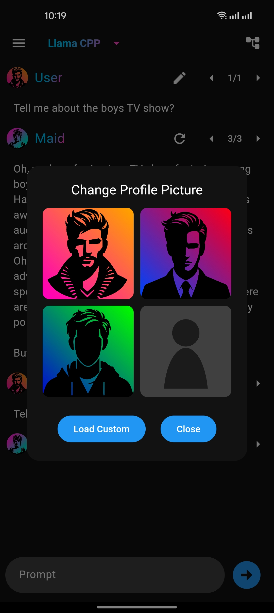
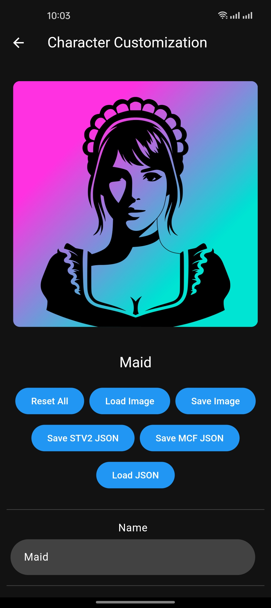
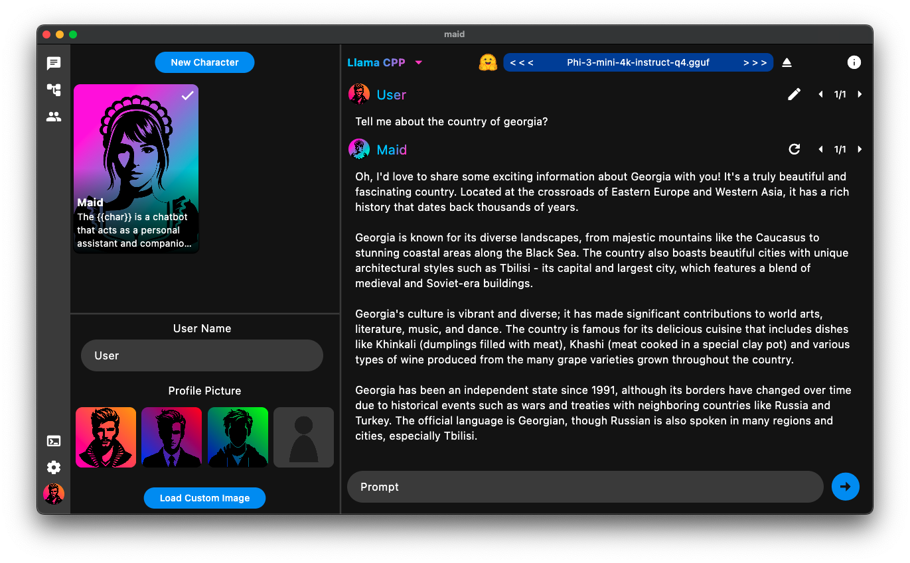
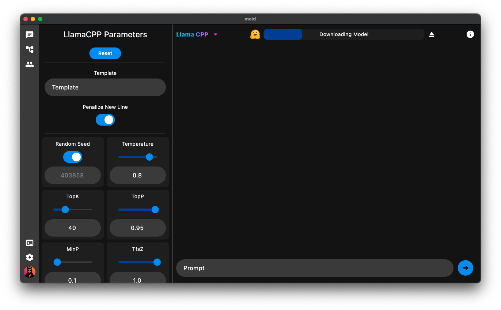
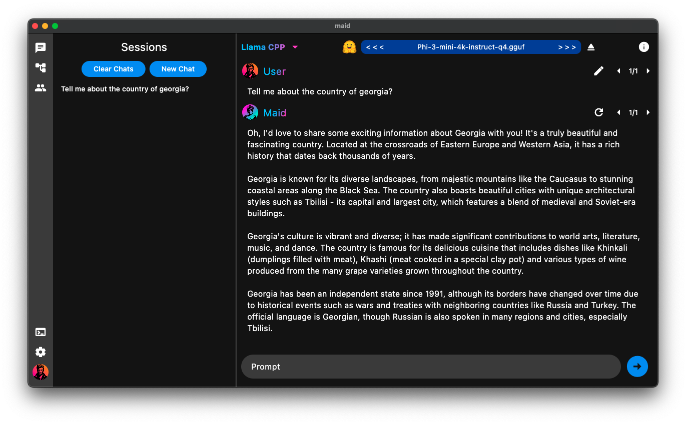

<div align="center">
  
</div>

# Maid - Mobile Artificial Intelligence Distribution

[](https://github.com/Mobile-Artificial-Intelligence/maid/actions/workflows/build-android.yml)
[](https://github.com/Mobile-Artificial-Intelligence/maid/actions/workflows/build-linux.yml)
[](https://github.com/Mobile-Artificial-Intelligence/maid/actions/workflows/build-macos.yml)
[](https://github.com/Mobile-Artificial-Intelligence/maid/actions/workflows/build-windows.yml)

<div align="center">
<a href="https://f-droid.org/packages/com.danemadsen.maid/">
  
</a>
<a href='https://play.google.com/store/apps/details?id=com.danemadsen.maid&pcampaignid=pcampaignidMKT-Other-global-all-co-prtnr-py-PartBadge-Mar2515-1'>
  
</a>
</div>

Maid is an cross-platform free and open source application for interfacing with llama.cpp models locally, and remotely with Ollama, Mistral, Google Gemini and OpenAI models remotely. Maid supports sillytavern character cards to allow you to interact with all your favorite characters. Maid supports downloading a curated list of Models in-app directly from huggingface.

[](https://discord.com/invite/yEQ6SJny)

<div align="center">
  <table>
    <tr>
      <td></td>
      <td></td>
      <td></td>
    </tr>
    <tr>
      <td></td>
      <td></td>
      <td></td>
    </tr>
  </table>
  
  
  
</div>

## Cloning
Maid utilises git submodules extensively. To clone the repository, use the following command:

```bash
git clone --recursive https://github.com/Mobile-Artificial-Intelligence/maid.git
```

Maids repository has flutter linked as a submodule. This is needed for reproducable fdroid builds.
However, for development you may want to use a local install of flutter. Remove the flutter submodule by running the git command

```bash
git submodule deinit -f packages/flutter
```

## Installing Build Dependencies
To install the dependencies on fedora based systems, use the following command:

```bash
sudo dnf install -y cmake ninja-build pkg-config gtk3-devel vulkan-devel
```

To install the bdependencies on debian based systems, use the following command:

```bash
sudo apt-get install -y cmake ninja-build pkg-config libgtk-3-dev libvulkan-dev
```

## Platform Support
Windows, MacOS, Linux, Android.
[Releases page.](https://github.com/Mobile-Artificial-Intelligence/maid/releases)
IOS Releases not available at this time.

## Help Wanted
- Write code comments
- Documentation
- Testing and Building on IOS
- Spreading the word
- [Google Play Testing](https://github.com/Mobile-Artificial-Intelligence/maid/discussions/499)

## Special Thanks and Related Projects
- [ggerganov/llama.cpp](https://github.com/ggerganov/llama.cpp)
- [ollama/ollama](https://github.com/ollama/ollama)
- [davidmigloz/langchain_dart](https://github.com/davidmigloz/langchain_dart)
- [Mobile-Artificial-Intelligence/maid_llm](https://github.com/Mobile-Artificial-Intelligence/maid_llm)
- [Mobile-Artificial-Intelligence/babylon_tts](https://github.com/Mobile-Artificial-Intelligence/babylon_tts)
- [Mobile-Artificial-Intelligence/babylon.cpp](https://github.com/Mobile-Artificial-Intelligence/babylon.cpp)

## Star History

[](https://star-history.com/#Mobile-Artificial-Intelligence/maid&Date)

## Contributors

<a href="https://github.com/Mobile-Artificial-Intelligence/maid/graphs/contributors">
  
</a>

## Testing
MacOS version tested on a 
Android version tested on a Oneplus 10 Pro 11gb phone.
Also tested on Fedora Linux, Windows 11.
Tested with calypso 3b, orcamini 3b, minyllama 1.1b, phi 3, mistral 7b, mixtral 8x7b, llama 2 7B-Chat, llama 7B and many more.

## Disclaimer

Maid is distributed under the MIT licence and is provided without warrenty of any kind, express or implied. Maid is not affiliated with Huggingface, Meta (Facebook), MistralAi, OpenAI, Google, Microsoft or any other company providing a model compatible with this application.
