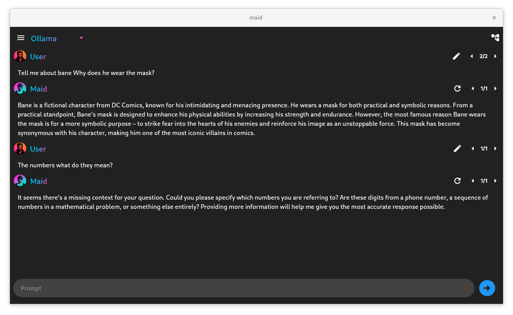

<div align="center">
  
</div>

# Maid - Mobile Artificial Intelligence Distribution

<a href="https://f-droid.org/packages/com.danemadsen.maid/">
  
</a>

Maid is an cross-platform free and open source application for interfacing with llama.cpp models locally, and with Ollama, Mistral, Google Gemini and OpenAI models remotely.

Maid supports sillytavern character cards to allow you to interact with all your favorite characters.

<div align="center">
  <table>
    <tr>
      <td></td>
      <td></td>
      <td></td>
    </tr>
    <tr>
      <td></td>
      <td></td>
      <td></td>
    </tr>
  </table>
  <table>
    <tr>
      <td></td>
      <td></td>
    </tr>
    <tr>
      <td></td>
      <td></td>
    </tr>
  </table>
</div>

## Cloning
Maid utilises git submodules extensively. To clone the repository, use the following command:

```bash
git clone --recursive https://github.com/Mobile-Artificial-Intelligence/maid.git
```

Maids repository has flutter linked as a submodule. This is needed for reproducable fdroid builds.
However, for development you may want to use a local install of flutter. Remove the flutter submodule by running the git command

```bash
git submodule deinit -f packages/flutter
```

## Installing Build Dependencies
To install the dependencies on fedora based systems, use the following command:

```bash
sudo dnf install -y cmake ninja-build pkg-config gtk3-devel vulkan-devel
```

To install the bdependencies on debian based systems, use the following command:

```bash
sudo apt-get install -y cmake ninja-build pkg-config libgtk-3-dev libvulkan-dev
```

## Platform Support
Windows, Linux, Android.
[Releases page.](https://github.com/Mobile-Artificial-Intelligence/maid/releases)
MacOS and IOS Releases not available at this time.

## Help Wanted
- Write code comments
- Documentation
- Testing and Building on MacOS and IOS
- Spreading the word
- [Google Play Testing](https://github.com/Mobile-Artificial-Intelligence/maid/discussions/499)

## Special Thanks and Related Projects
- [davidmigloz/langchain_dart](https://github.com/davidmigloz/langchain_dart)
- [Mobile-Artificial-Intelligence/maid_llm](https://github.com/Mobile-Artificial-Intelligence/maid_llm)

## Testing
Android version tested on a Oneplus 10 Pro 11gb phone.
Also tested on Fedora Linux, Windows 11.
Tested with calypso 3b, orcamini 3b, llama 2 7B-Chat, llama 7B and many more.
